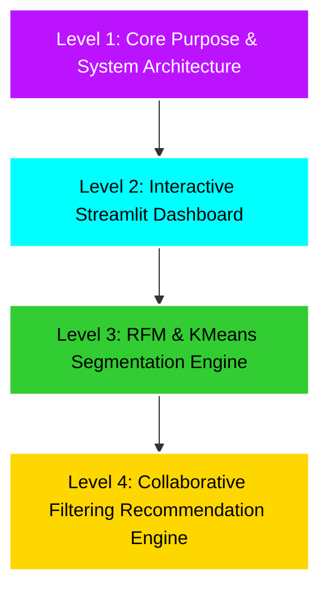

# Shopper Spectrum 🛒: E-Commerce Customer Segmentation & Product Recommendations

An end-to-end, high-performance unsupervised machine learning and recommendation system designed to unlock insights from online transaction data. This platform integrates a **business command center**, an **interactive customer segment predictor**, and an **item-based collaborative filtering engine** under a sleek, high-tech cyberpunk user interface built with Streamlit.

---

## 📐 Project Architecture (The Pyramid View)

This project is built using a **Pyramid structure**, progressing from the broad application purpose and visual layout, down to the technical implementation details of the segmentation and recommendation engines.



---

## 🌐 Level 1: System Purpose & Repository Structure

### Purpose

The core objective of **Shopper Spectrum** is to transform raw, noisy transaction logs into actionable marketing and inventory strategies. By analyzing shopping behaviors, the system:

1. **Clusters Customers** based on Recency, Frequency, and Monetary (RFM) dynamics to run targeted retention and loyalty campaigns.
2. **Recommends Products** by analyzing cross-purchasing patterns (collaborative filtering) to increase average order values (AOV) via intelligent cross-selling.

### Repository Layout

```Markdown
6-Shopping-Spectrum/
├── app.py                      # Main Streamlit web application
├── requirements.txt            # Python dependencies (Streamlit, Scikit-Learn, Plotly, etc.)
├── assets/                     # UI styling and visual assets
│   ├── style.css               # Custom Cyberpunk stylesheets (backdrop blurs, custom glow borders)
│   ├── business insights.png   # Dashboard screenshot
│   ├── products recommendation.png # Recommender screenshot
│   ├── segmentation predictor.png  # Segment predictor screenshot
│   └── segmentation metrics.png # Benchmarks and radar charts
├── src/                        # Core application source modules
│   └── data_loader.py          # Data ingestion and model deserialization functions
├── models/                     # Serialized machine learning artifacts
│   ├── scaler.pkl              # Fitted RFM StandardScaler pipeline
│   ├── kmeans_model.pkl        # Trained KMeans (K=4) clustering model
│   ├── cluster_mapping.pkl     # Centroid-to-segment label map
│   └── product_similarity.pkl  # Optimized pre-computed similarity dictionary
├── notebooks/                  # Experimental analysis & modeling notebooks
│   ├── EDA_Analysis.ipynb      # In-depth Exploratory Data Analysis
│   └── Customer_Segmentation_Clustering.ipynb # Segmentation & Recommender prototyping
├── scripts/                    # Automation scripts
│   └── build_notebooks.py      # Programmatic generation script for Jupyter notebooks
└── data/                       # Local raw dataset storage
    └── online_retail.csv       # Transaction logs (541k+ rows, ISO-8859-1 encoding)
```

---

## 📱 Level 2: Interactive Streamlit UI

The user interface follows a high-fidelity **Cyberpunk Command Center** design, utilizing dark charcoal surfaces (`#161B1B`), neon purple indicators (`#BC13FE`), cyan data plots (`#00FFFF`), and styled glassmorphic widgets.

### 1. Business Insights Dashboard

The executive view calculates key performance indicators (KPIs) from transaction history in real-time, visualizing monthly revenue trends and geographical transaction shares.


* **Key Features:**
  - Automated KPI cards: Total Revenue ($M), Invoice Counts, Active Customer Base, and Average Order Value.
  - Interactive line charts mapping seasonal sales trends.
  - Geographical distribution charts highlighting major market shares.

---

### 2. Customer Segmentation Predictor

Allows marketing teams to input a customer's purchasing history (Recency, Frequency, Monetary) to instantly predict their segment.


* **Key Features:**
  - Real-time prediction card indicating customer group with custom glow boundaries (e.g. Gold for High-Value, Red for At-Risk).
  - Radar chart contrasting the customer's attributes against the segment average.
  - Complete, interactive benchmark guide mapping typical metric ranges (IQR) and suggested marketing strategies for each segment.


---

### 3. Product Recommender Engine

An inventory look-up tool returning the top 5 highly associated products along with purchase similarity percentages.


* **Key Features:**
  - Auto-complete query search to prevent typographical errors.
  - Custom HTML cards containing animated match-percentage indicators.

---

## 🎯 Level 3: Unsupervised Customer Segmentation Engine

The segmentation engine groups customers based on buying characteristics using **Recency, Frequency, and Monetary (RFM)** modeling combined with **K-Means Clustering**.

### 1. RFM Feature Engineering

Given a customer $c$, their behavioral indicators are calculated from transaction histories:

* **Recency ($R_c$):** The number of days elapsed between the customer's last purchase and a reference date (maximum date in the dataset plus 1 day).
  $$
  R_c = \text{InvoiceDate}_{\text{max}} + 1 - \max_{i \in T_c}(\text{InvoiceDate}_i)
  $$
* **Frequency ($F_c$):** The total number of unique invoices (orders) submitted by the customer.
  $$
  F_c = |\{\text{InvoiceNo}_i \mid i \in T_c\}|
  $$
* **Monetary ($M_c$):** The total monetary value of all successful transactions.
  $$
  M_c = \sum_{i \in T_c} (\text{Quantity}_i \times \text{UnitPrice}_i)
  $$

### 2. Preprocessing & Skewness Correction

RFM indicators typically exhibit extreme right skewness. When clustering raw data, Euclidean distance calculations are heavily distorted by high-value outliers (e.g., bulk retail distributors), packing $95\%$ of normal customers into a single, meaningless cluster.

To resolve this:

1. **Log-Transformation:** A logarithmic map is applied to stabilize variance and normalize distributions:
   $$
   x_{\text{transformed}} = \log(x + 1)
   $$
2. **Standardization:** Standard scaling centers and scales features to zero mean ($\mu = 0$) and unit variance ($\sigma = 1$):
   $$
   z = \frac{x_{\text{transformed}} - \mu}{\sigma}
   $$

### 3. KMeans Optimization & Tuning

The K-Means algorithm minimizes the within-cluster sum-of-squares (Inertia):

$$
J = \sum_{j=1}^{K} \sum_{z_i \in C_j} \|z_i - \mu_j\|^2
$$

I tuned $K \in [2, 8]$ using:

* **Elbow Curve (Inertia):** Finding the point of diminishing returns.
* **Silhouette Analysis:** Assessing cluster separation and cohesion.
* **Result:** $K = 4$ was selected as the optimal structure.

```
       Segment Name       |  Customers  |  Recency (Median)  |  Frequency (Median)  |  Monetary (Median)
--------------------------|-------------|--------------------|----------------------|--------------------
🥇 High-Value (VIP)       |  732 (17%)  |     7.0 days       |     10.0 orders      |     $3,699.70
🥈 Regular (Loyal Core)   |  1152 (27%) |    56.0 days       |      4.0 orders      |     $1,352.40
🥉 Occasional (Sporadic)  |  857 (20%)  |    16.0 days       |      2.0 orders      |       $471.70
🚨 At-Risk (Lapsing)      |  1597 (36%) |   177.0 days       |      1.0 order       |       $298.10
```

---

## 🛒 Level 4: Item-Based Collaborative Recommender Engine

Instead of recommending products based on text descriptions or attributes (Content-Based), the recommender uses **collaborative item filtering** to identify products that are frequently bought together by customers.

### 1. Customer-Product Pivot Matrix

I construct a sparse pivot matrix $X \in \mathbb{R}^{N_c \times N_p}$ where rows are customers ($N_c \approx 4338$) and columns are product catalogs ($N_p \approx 3665$).
To prevent recommendations from being dominated by high-quantity bulk purchases, the matrix values are clipped to a binary format representing purchase engagement:

$$
Y_{c, p} = \min(X_{c, p}, 1) \in \{0, 1\}
$$

### 2. Product Cosine Similarity

For any two products $p_1$ and $p_2$, similarity is computed as the cosine of the angle between their transaction history vectors $\mathbf{v}_{p_1}$ and $\mathbf{v}_{p_2}$ across all customers:

$$
\text{similarity}(p_1, p_2) = \cos(\theta) = \frac{\mathbf{v}_{p_1} \cdot \mathbf{v}_{p_2}}{\|\mathbf{v}_{p_1}\| \|\mathbf{v}_{p_2}\|} = \frac{\sum_{c} Y_{c, p_1} Y_{c, p_2}}{\sqrt{\sum_{c} Y_{c, p_1}^2} \sqrt{\sum_{c} Y_{c, p_2}^2}}
$$

Since $Y$ is binary, this simplifies to the size of the overlapping customer set divided by the geometric mean of the individual customer sets:

$$
\text{similarity}(p_1, p_2) = \frac{|\text{Customers}(p_1) \cap \text{Customers}(p_2)|}{\sqrt{|\text{Customers}(p_1)| \cdot |\text{Customers}(p_2)|}}
$$

### 3. Serialization & Performance Optimization

> [!TIP]
> Calculating a similarity matrix of size $3665 \times 3665$ in real-time requires calculating over $13.4 \text{ million}$ combinations, which introduces massive compute latency in Streamlit.
>
> To resolve this, during the model build pipeline:
>
> 1. I pre-calculate all similarities.
> 2. For each product, I slice the top 10 most similar items and save them into a serialized dictionary:
>    $$
>    \text{Lookup Dict}: \text{Product} \mapsto [(\text{Product}_1, s_1), (\text{Product}_2, s_2), \dots]
>    $$
> 3. The dict is saved as `models/product_similarity.pkl`.
> 4. In Streamlit, queries execute in $O(1)$ time, yielding **sub-millisecond** retrieval speeds.

---

## 🚀 Getting Started

### 1. Installation

Clone the repository and install the required modules:

```bash
pip install -r requirements.txt
```

### 2. Preprocess & Re-train Models (Optional)

If you want to re-run the EDA analysis and rebuild the similarity maps/KMeans clusters:

```bash
python scripts/build_notebooks.py
```

This script programmatically populates the Jupyter Notebooks. You can open and execute the notebooks in `notebooks/` to export new models to `models/`.

### 3. Run the Web Application

Launch the Streamlit dashboard locally:

```bash
streamlit run app.py
```

The application will launch on your default browser at `http://localhost:8501`.
