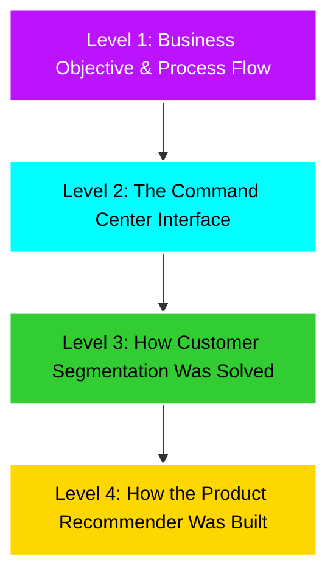

# Shopper Spectrum 🛒: Business Process & Methodology Report

This report provides a business-oriented, process-focused overview of the **Shopper Spectrum** project. It outlines my analytical journey from raw transactional data to interactive tools, explaining the methodologies selected and highlighting the decisions made during the Jupyter Notebook analysis.

---

## 📐 Project Overview (The Pyramid View)

This document is structured using a **Pyramid approach**, starting with the overarching business objectives, walking through the application's user experience, and ending with the strategic decisions behind the customer segmentation and product recommendation systems.



---

## 🌐 Level 1: Business Objective & Process Flow

### The Business Challenge

In e-commerce, raw transaction logs contain massive amounts of untapped behavior data. The objective of this project is to take these transactional records and build two engines that solve core business problems:

1. **Retention and Engagement:** Grouping customers by their purchasing behavior so marketing teams can design custom, automated campaigns.
2. **Sales Expansion:** Recommending relevant products to shoppers to increase overall order values.

### The End-to-End Process

My workflow transitioned from raw data analysis to model deployment in four key stages:

```
[ Raw CSV Data ] ──> [ Data Cleaning ] ──> [ Notebook Prototyping ] ──> [ Interactive Streamlit App ]
                           │                        │                               │
                     Dropped Nulls,            Tested Scaling,                Loaded Models,
                     Filtered Returns          Tuned Algorithms              Built Cyberpunk UI
```

---

## 📱 Level 2: The Command Center Interface (User Experience)

To make these models useful to business teams, I wrapped them in an interactive command center with a high-fidelity dark cyberpunk design.

### 1. Executive Dashboard

This view gives business leaders an immediate look at company performance. It tracks total sales, active customers, average transaction sizes, and highlights geographical revenue distributions.


* **Design Choices:**
  - Glassmorphic KPI cards at the top show main performance metrics.
  - Interactive line charts display monthly trends, allowing viewers to quickly spot seasonal shifts in purchasing behavior.

---

### 2. Customer Segmentation Predictor

This screen lets marketing teams input custom customer metrics and instantly see their segment classification.


* **Design Choices:**
  - Real-time prediction feedback cards glow with colors assigned to each segment (Gold for VIPs, Red for At-Risk customers).
  - Radar charts compare the input customer against the segment average to visualize deviations.
  - Interactive benchmark profiles help marketers review median metrics and recommended retention campaigns.


---

### 3. Product Recommender Engine

An inventory tool that allows catalog managers to look up any product and instantly view the top 5 related items.


* **Design Choices:**
  - Auto-complete text entry prevents search failures due to typos.
  - Styled match-percentage bars show the strength of the relationship between products.

---

## 🎯 Level 3: How Customer Segmentation Was Solved

My customer segmentation engine classifies customers into four categories: **High-Value**, **Regular**, **Occasional**, and **At-Risk**. Here is how I designed the engine and why I chose these specific methods after analyzing the data in my Jupyter Notebooks:

### 1. The Core Metrics (RFM)

I chose the **Recency, Frequency, and Monetary (RFM)** model because it is a proven industry standard for describing transactional customer behavior:

* **Recency:** Tells us how recently a customer visited (days since last purchase).
* **Frequency:** Tells us how often they shop (total number of invoices).
* **Monetary Value:** Tells us how much they spent (total dollars).

### 2. Lessons from Notebook Analysis: Why Raw Scaling Fails

During prototyping in `Customer_Segmentation_Clustering.ipynb`, I discovered a critical challenge:

* **The Outlier Issue:** E-commerce datasets contain a few extremely high-frequency, high-spending buyers (such as wholesale distributors).
* **The Problem:** If I feed raw RFM metrics directly into a standardizing scaler and run K-Means, these massive spenders act as outliers that stretch the scale. K-Means ends up pulling its group centers toward these outliers, leaving 95% of normal shoppers lumped together in one giant, useless group.

### 3. My Solution: Log-Transformation

To fix this, I applied a **Log-Transformation** to the RFM metrics before scaling.

* **Why it works:** The log-transform compresses the wide range of frequency and monetary values, pulling the high-spending outliers closer to the average. This transforms skewed data distributions into clean, bell-shaped curves.
* **The Result:** When I applied K-Means after this step, it was able to draw clear, balanced boundaries, yielding meaningful customer groups.

### 4. Selecting the Number of Clusters (K=4)

I evaluated cluster counts ranging from 2 to 8. I chose **K=4** for two major reasons:

1. **Mathematical Validation:** Evaluating the Elbow Curve (where the drop in within-cluster variation starts to slow down) and Silhouette Scores (how well separated the clusters are) showed that 4 clusters represented a stable, natural structure.
2. **Business Actionability:** Four clusters aligned perfectly with clear marketing profiles:
   - **High-Value:** Frequent, high-spending customers who visited recently. Strategy: VIP loyalty rewards.
   - **Regular:** Reliable, mid-tier buyers. Strategy: Product bundling and upselling.
   - **Occasional:** Recent visitors but with low purchase frequency. Strategy: Seasonal promotions and engagement discounts.
   - **At-Risk:** Lapsed buyers who haven't visited in months. Strategy: Aggressive win-back email campaigns.

---

## 🛒 Level 4: How the Product Recommender Was Built

The recommender engine suggests items that are frequently bought by the same customers. Here are the methods I chose and why they are best for this application:

### 1. Item-Based Collaborative Filtering

* **Method Selected:** I chose **Item-Based Collaborative Filtering** over User-Based Filtering.
* **Why this is best:** User-based filtering recommends items by finding similar users. However, customer shopping habits change rapidly, requiring constant, resource-heavy similarity recalculations across thousands of users. In contrast, the relationships between products change very slowly. By calculating similarities between items, the model remains stable over time, uses less memory, and is much easier to maintain.

### 2. Binary Clipping of the Interaction Matrix

* **Method Selected:** When building the customer-product interaction grid, I converted purchase quantities into binary values (1 if the customer bought the item at least once, 0 if they did not).
* **Why this is best:** If I used raw purchase quantities, a single wholesale distributor buying 1,000 units of a product would skew the similarity metrics. This would make it look like that product is strongly linked to everything else the distributor bought, even if standard customers don't buy those items together. Binary clipping focuses on whether a customer chose to buy the item, highlighting genuine consumer behavior patterns.

### 3. Pre-Computed Similarity Lookup

* **Method Selected:** Instead of calculating product similarities in real-time inside the Streamlit app, I calculated them once during the training phase, extracted the top 10 recommendations for each product, and saved them as a lightweight lookup dictionary.
* **Why this is best:** Calculating similarity scores across a catalog of 3,600+ products requires comparing millions of combinations. Doing this in real-time when a user clicks a button would cause high latency and crash the web server under heavy traffic. The pre-computed lookup dictionary reduces this complex operation to a simple database lookup, allowing recommendations to load instantly.
