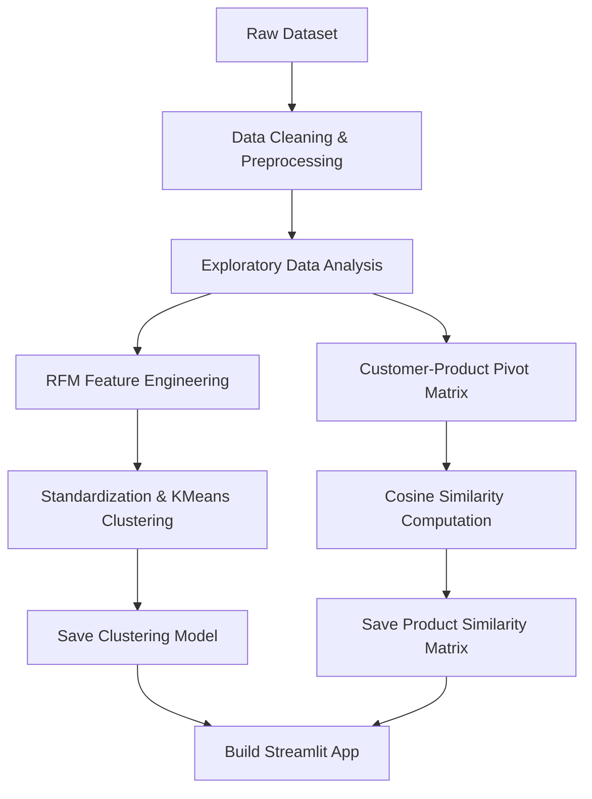

# Project Clarification: Shopper Spectrum 🛒
## Customer Segmentation & Product Recommendations in E-Commerce

This document provides a comprehensive overview of the **Shopper Spectrum** project. It clarifies the project scope, analyzes the underlying dataset, outlines the end-to-end technical approach, and details the final application requirements.

---

## 1. Project Scope
The goal of this project is to leverage unsupervised machine learning and recommendation systems to analyze online transaction data, identify distinct customer segments, and recommend products to users.

### Key Objectives:
1. **Data Preprocessing & Cleaning:** Clean a raw retail transactions dataset containing missing values, returns, and cancellations.
2. **Exploratory Data Analysis (EDA):** Extract behavioral insights, analyze transactions by country, find top-selling items, and visualize purchase distributions.
3. **Customer Segmentation (RFM + KMeans):**
   - Perform Recency, Frequency, and Monetary (RFM) feature engineering.
   - Standardize RFM features.
   - Use clustering algorithms (primarily **KMeans**) to segment customers.
   - Evaluate clusters using the Elbow Method and Silhouette Score.
   - Classify customers into 4 segments: **High-Value**, **Regular**, **Occasional**, and **At-Risk**.
4. **Product Recommendation System:**
   - Implement **Item-based Collaborative Filtering**.
   - Build a Customer-Product interaction matrix.
   - Compute product similarities using **Cosine Similarity**.
   - Generate the top 5 product recommendations based on a given product.
5. **Interactive Web Application (Streamlit):**
   - Create a clean and modern UI.
   - Include a **Product Recommendation Module** (text input for a product -> displays top 5 similar products).
   - Include a **Customer Segmentation Module** (RFM inputs -> predicts customer segment).

---

## 2. Underlying Dataset Analysis
The project uses the `online_retail.csv` dataset, which contains transactional data over a 1-year period.

### Dataset Overview:
* **File Name:** `online_retail.csv`
* **Raw Shape:** 541,909 rows, 8 columns
* **Temporal Range:** `2022-12-01 08:26:00` to `2023-12-09 12:50:00`

### Column Description:
| Column | Data Type | Description |
| :--- | :--- | :--- |
| **InvoiceNo** | Object / String | Unique transaction identifier. Code starting with 'C' indicates a cancellation. |
| **StockCode** | Object / String | Unique product/item identifier. |
| **Description** | Object / String | Name of the product. |
| **Quantity** | Integer | Number of units purchased per transaction. |
| **InvoiceDate** | Object / String | Date and time when the transaction was generated. |
| **UnitPrice** | Float | Price per single unit of the product. |
| **CustomerID** | Float / Object | Unique identifier for each customer. |
| **Country** | Object / String | Country where the customer resides. |

### Data Quality & Issues Identified:
Through programmatic analysis of the raw CSV, we identified the following characteristics and data anomalies:
* **Missing Values:**
  - `CustomerID` is missing in **135,080 rows** (~24.9% of the dataset). Since customer segmentation is the primary goal, these rows cannot be imputed and must be removed.
  - `Description` is missing in **1,454 rows** (these rows are subset of missing `CustomerID`).
* **Cancelled Invoices:**
  - **9,288 transactions** are cancellations (where `InvoiceNo` starts with 'C').
* **Negative/Zero Values:**
  - **10,624 records** have negative values in `Quantity` (representing returns/cancellations).
  - **2 records** have negative values in `UnitPrice`.
  - **2,515 records** have a unit price of `0.00` (representing free items or administrative adjustments).
* **Geographical Distribution:**
  - The dataset is heavily concentrated in the **United Kingdom** (495,478 transactions, ~91.4%), followed by Germany (9,495), France (8,557), EIRE (8,196), and Spain (2,533).
* **Post-Cleaning Statistics:**
  - Applying all data cleaning rules (removing null `CustomerID`, filtering out cancellations, and removing non-positive quantities and prices) reduces the dataset to **397,884 rows**.
  - Unique Customers: **4,338** (down from 4,372 raw).
  - Unique Products: **3,665** (down from 4,070 raw).

---

## 3. Implementation Approach

Our approach consists of the following structured phases:

### Phase 1: Preprocessing & Cleaning
1. Remove all rows where `CustomerID` is null.
2. Filter out cancelled transactions by checking if `InvoiceNo` starts with `'C'`.
3. Filter out all rows where `Quantity <= 0` or `UnitPrice <= 0`.
4. Parse `InvoiceDate` into datetime objects.
5. Create a `TotalAmount` column (`Quantity * UnitPrice`) to facilitate monetary analysis.

### Phase 2: Exploratory Data Analysis (EDA)
1. Visualize the distribution of transaction volume and revenue across different countries.
2. Plot top-selling products by quantity and revenue.
3. Analyze transaction volume and sales trends across months, days of the week, and hours of the day.
4. Visualize distributions of standard fields and engineered RFM parameters.

### Phase 3: RFM Feature Engineering & Clustering
1. **Recency ($R$):** Determine the reference date as the maximum `InvoiceDate` in the dataset + 1 day. Compute the number of days between the reference date and each customer's latest purchase.
2. **Frequency ($F$):** Count the number of unique invoices associated with each customer.
3. **Monetary ($M$):** Sum the `TotalAmount` spent by each customer.
4. **Standardization:** Since KMeans is highly sensitive to feature scaling and outliers, transform the RFM parameters using log-transforms or `PowerTransformer` (to handle skewness), followed by `StandardScaler` to bring them to a standard scale.
5. **Clustering:** 
   - Run KMeans for $K \in [1, 10]$ and compute Inertia and Silhouette Scores.
   - Use the Elbow Method to identify the optimal $K$.
   - Train the final KMeans model with the optimal $K$ (e.g., $K = 4$ as specified by the segment definitions).
   - Interpret the cluster centroids and assign labels:
     - **High-Value:** High R, High F, High M (frequent, recent big spenders).
     - **Regular:** Medium F, Medium M (steady buyers, not premium).
     - **Occasional:** Low F, Low M, Older R (rare purchases).
     - **At-Risk:** High R (days since last purchase), Low F, Low M (lapsed customers).
6. **Save Artifacts:** Save the fitted scaler and clustering model using `pickle` or `joblib`.

### Phase 4: Product Recommendation System
1. Build a sparse customer-product pivot matrix with `CustomerID` as rows, product descriptions (or `StockCode`) as columns, and the sum of `Quantity` (or binary purchase indicator) as values.
2. Calculate the cosine similarity matrix between the columns (products).
3. Build a recommendation lookup dictionary or DataFrame.
4. Define a function `get_recommendations(product_name, top_n=5)` that searches for the product in the similarity matrix, finds the top $N$ most similar products, and returns them along with their similarity scores.

### Phase 5: Streamlit Web Application
1. **UI Design:**
   - Premium, clean layout with interactive controls.
   - Utilize a sidebar for navigation between modules or system description.
2. **Module 1: Product Recommender:**
   - A search bar with autocomplete suggestions for product descriptions (to prevent typos).
   - Dynamic recommendation cards that display the top 5 matching items.
3. **Module 2: Customer Segment Predictor:**
   - Input fields (using slider or number inputs) for Recency, Frequency, and Monetary value.
   - Performs scaling and KMeans prediction in real-time.
   - Displays the customer segment label using styled HTML alerts/cards.

---

## 4. Project Deliverables
1. **`Shopper_Spectrum.ipynb`**: The Jupyter Notebook containing data preprocessing, EDA plots, RFM calculation, KMeans model training/evaluation, and recommendation matrix computation.
2. **`app.py`**: The Streamlit application source code.
3. **Saved Models:**
   - `kmeans_model.pkl` (The trained clustering model)
   - `scaler.pkl` (The trained scaler for RFM inputs)
   - `product_similarity.pkl` (The computed product similarity matrix or interaction data)
4. **`requirements.txt`**: Python dependencies required to run the notebook and Streamlit application.
5. **`project_clarification.md`**: This document containing scope, dataset analysis, and technical details.
